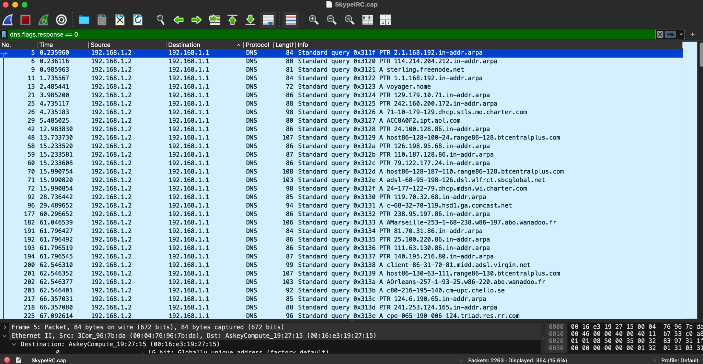
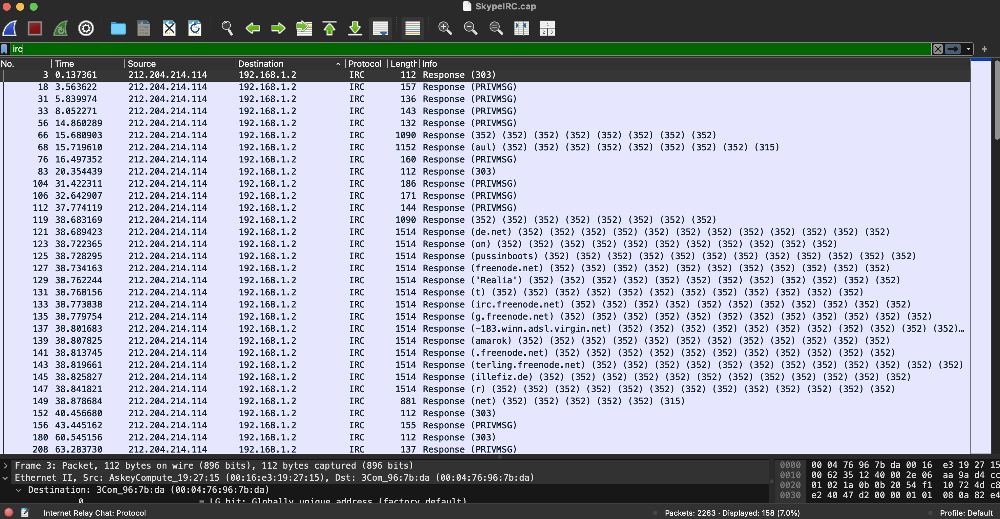

# Wireshark Network Traffic Analysis

## Project Overview

This project analyzes a network packet capture using Wireshark to better understand network communication and identify the activity of a primary host.

The goal of this project was to practice network traffic analysis by identifying hosts, examining network conversations, analyzing DNS activity, and investigating application-layer protocols such as IRC.

## Tools Used

- Wireshark
- PCAP network capture
- GitHub

## Dataset

The analysis was performed using the `SkypeIRC.cap` sample packet capture from Wireshark's sample capture collection.

The capture contains 2,263 packets representing multiple types of network communication.

## Initial Network Analysis

Using Wireshark's Endpoints and Conversations statistics, I identified `192.168.1.2` as the primary host in the capture.

- Total packets: 2,263
- Packets involving `192.168.1.2`: 2,245
- IPv4 conversations observed: 182
- Largest local conversation: `192.168.1.2 <-> 192.168.1.1`
- Packets in this conversation: 707
- Data transferred: approximately 74 kB

Further analysis showed that the communication between `192.168.1.2` and `192.168.1.1` consisted of DNS traffic.

## Protocol Analysis

Wireshark's Protocol Hierarchy statistics showed that the capture contained both TCP and UDP traffic.

| Protocol | Packets | Percentage |
|---|---:|---:|
| TCP | 1,150 | 50.8% |
| UDP | 1,072 | 47.4% |
| DNS | 707 | 31.2% |
| IRC | 158 | 7.0% |
| ICMP | 23 | 1.0% |
| TLS | 16 | 0.7% |
| ARP | 10 | 0.4% |
| HTTP | 4 | 0.2% |

Although IRC represented only 7.0% of the packets, it accounted for 26.7% of the bytes in the capture.

### Protocol Hierarchy

## DNS Analysis

DNS traffic was one of the most common types of traffic in the capture, accounting for 707 packets (31.2% of the total capture).

I filtered the packet capture to examine DNS queries using:

`dns.flags.response == 0`

The analysis showed the primary host making DNS requests for multiple domain names, including:

- `voyager.home`
- `ui.skype.com`
- `bbd933.home.cwgsy.net`
- `ALL-SYSTEMS.MCAST.NET`
- `tm.net.my`

The DNS traffic helped identify services and systems that the primary host attempted to communicate with during the capture.

### DNS Query Analysis

Filtering for DNS queries returned 354 packets, with the primary host 192.168.1.2 sending queries to 192.168.1.1.

## IRC Traffic Analysis

The packet capture contained 158 IRC (Internet Relay Chat) packets, representing 7.0% of the total packets in the capture. Although IRC accounted for a relatively small percentage of packets, it represented 26.7% of the captured bytes.

I filtered the capture using:

`irc`

The analysis showed IRC communication involving the primary host `192.168.1.2`. I observed several IRC commands and responses, including:

- `PRIVMSG`
- `WHO`
- `QUIT`
- Numeric replies such as `303` and `352`

I then filtered for `PRIVMSG` traffic and identified 43 matching packets directed to the primary host. This demonstrated how Wireshark can be used to isolate specific application-layer activity and determine the direction of network communication.

### IRC Traffic

## Key Findings

The packet capture contained 2,263 packets, with `192.168.1.2` identified as the primary host based on its involvement in 2,245 packets.

Key observations from the investigation included:

- `192.168.1.2` was involved in the majority of network traffic in the capture.
- The largest local conversation occurred between `192.168.1.2` and `192.168.1.1`, containing 707 packets and approximately 74 kB of traffic.
- This local communication consisted primarily of DNS traffic.
- DNS represented 31.2% of the total packets, with 354 DNS queries identified using a display filter.
- DNS analysis revealed both A record lookups and PTR reverse-DNS lookups.
- IRC represented 158 packets, or 7.0% of the capture, but accounted for 26.7% of the captured bytes.
- IRC traffic included commands and responses such as `PRIVMSG`, `WHO`, `QUIT`, `303`, and `352`.
- IRC communication was observed between the primary host `192.168.1.2` and `212.204.214.114`.

Based on the traffic analyzed, the capture demonstrates DNS, IRC, and other normal network communication. This analysis focused on understanding network behavior rather than labeling activity as malicious without supporting evidence.

## Skills Demonstrated

- Network traffic analysis with Wireshark
- Packet capture (PCAP) investigation
- TCP/IP and UDP traffic analysis
- DNS analysis
- IRC protocol analysis
- Identifying network endpoints and conversations
- Using Wireshark display filters
- Analyzing source and destination IP addresses
- Distinguishing DNS queries from responses
- Interpreting A and PTR DNS queries
- Documenting technical findings

## Wireshark Filters Used

`ip.addr == 192.168.1.2`

Used to isolate traffic involving the primary host.

`ip.addr == 192.168.1.1 && ip.addr == 192.168.1.2`

Used to analyze communication between the primary host and the local DNS system.

`dns.flags.response == 0`

Used to isolate DNS queries from DNS responses.

`irc`

Used to isolate IRC traffic.

`irc contains "PRIVMSG"`

Used to investigate IRC PRIVMSG traffic.

## What I Learned

This project helped me understand how Wireshark can be used to investigate a packet capture instead of simply viewing individual packets. I learned how to identify a primary host, examine conversations between devices, filter traffic by protocol, and use source and destination IP addresses to determine the direction of communication.

I also gained a better understanding of DNS traffic, including the difference between A record queries and PTR reverse-DNS queries. Analyzing the IRC traffic showed me how application-layer protocols can be identified and investigated within a packet capture.

Most importantly, I learned that a large amount of traffic or an unfamiliar IP address does not automatically mean that activity is malicious. Network traffic should be investigated and supported by evidence before reaching a conclusion.
