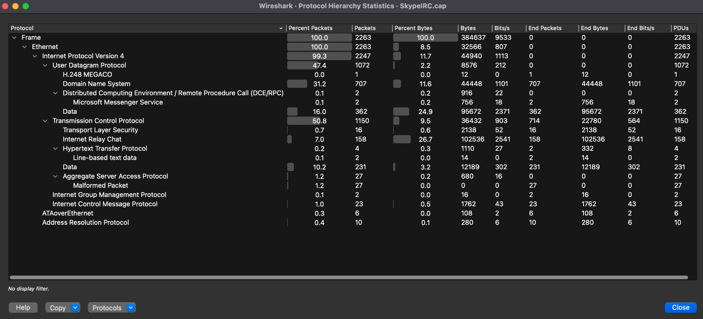

# Wireshark Network Traffic Analysis

## Project Overview

This project analyzes a network packet capture using Wireshark to better understand network communication and identify the activity of a primary host.

The goal of this project was to practice network traffic analysis by identifying hosts, examining network conversations, analyzing DNS activity, and investigating application-layer protocols such as IRC.

## Tools Used

- Wireshark
- PCAP network capture
- GitHub

## Dataset

The analysis was performed using the `SkypeIRC.cap` sample packet capture from Wireshark's sample capture collection.

The capture contains 2,263 packets representing multiple types of network communication.

## Initial Network Analysis

Using Wireshark's Endpoints and Conversations statistics, I identified `192.168.1.2` as the primary host in the capture.

- Total packets: 2,263
- Packets involving `192.168.1.2`: 2,245
- IPv4 conversations observed: 182
- Largest local conversation: `192.168.1.2 <-> 192.168.1.1`
- Packets in this conversation: 707
- Data transferred: approximately 74 kB

Further analysis showed that the communication between `192.168.1.2` and `192.168.1.1` consisted of DNS traffic.

## Protocol Analysis

Wireshark's Protocol Hierarchy statistics showed that the capture contained both TCP and UDP traffic.

| Protocol | Packets | Percentage |
|---|---:|---:|
| TCP | 1,150 | 50.8% |
| UDP | 1,072 | 47.4% |
| DNS | 707 | 31.2% |
| IRC | 158 | 7.0% |
| ICMP | 23 | 1.0% |
| TLS | 16 | 0.7% |
| ARP | 10 | 0.4% |
| HTTP | 4 | 0.2% |

Although IRC represented only 7.0% of the packets, it accounted for 26.7% of the bytes in the capture.

### Protocol Hierarchy

